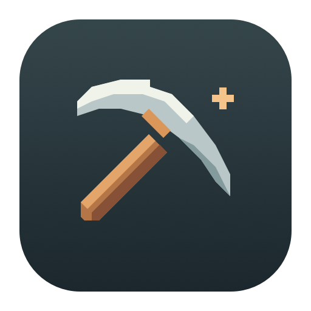

<p align="center"></p>

<h1 align="center">Stoneaxe</h1>

<p align="center">A little pickaxe in your menu bar. A real shot at a Bitcoin block.</p>

<p align="center">
  
  
  
</p>

<p align="center"><b>English</b> · <a href="README.ko.md">한국어</a></p>

Stoneaxe is a native macOS app that solo mines Bitcoin through
[CKPool](https://solo.ckpool.org/). An animated pixel pickaxe lives in the menu
bar while your Mac tries its luck. Add a receiving address, save, and let it run.

Built for the fun of it. The odds of finding a block on a Mac are extraordinarily
small; **accepted shares are not earnings**.

## Features

- **Native Metal mining.** SHA-256d on Apple Silicon, with CPU verification of every submitted result.
- **Adaptive scheduling.** Light work while using your Mac, gradual increases while away, and backoff when GPU jobs slow down.
- **Thermal awareness.** Reduces work as the system warms up, pauses under serious thermal pressure, and waits before resuming.
- **Menu bar companion.** Animated pickaxe, quick pause/resume, and Reduce Motion support.
- **Useful statistics.** Live and average hashrate, session/today/lifetime mining time, share outcomes, best difficulty, memory footprint, and JSON export.
- **Block notifications.** Distinguishes local candidates, pool acceptance, and observed main-chain inclusion. Candidate records survive restarts.
- **Local logs.** Searchable recent events and bounded, rotating diagnostic files.
- **English and Korean.** Optional launch at login; battery mining is off by default.

## Install

```sh
brew install --cask s3mng/tap/stoneaxe
```

Stoneaxe is currently ad-hoc signed and not notarized. macOS may block the first
launch. If it does, open **Applications** in Finder, Control-click **Stoneaxe**,
choose **Open**, then confirm **Open**. This exception applies only to Stoneaxe.

Requires Apple Silicon and macOS 14 or later.

### Build from source

Requires **Apple Silicon**, **macOS 14+**, and Xcode / Command Line Tools with
**Swift 5.9+**. There are no third-party package dependencies.

```sh
git clone https://github.com/s3mng/stoneaxe.git
cd stoneaxe
swift test
bash scripts/build-app.sh
open dist/Stoneaxe.app
```

Local builds are ad-hoc signed. Run the `.app` bundle, rather than `swift run`,
for notification and login-item integration.

## Get started

1. Open **Settings** and paste a Bitcoin mainnet receiving address from Sparrow or another wallet.
2. Leave **Enable automatic mining** on and select **Save & apply**.
3. Allow notifications if you want block discovery alerts.

Only the public receiving address is needed. **Never enter a seed phrase or
private key.** Sparrow does not need to stay open.

Use **Test connection** in Settings to check server access, address authorization,
and receipt of mining work before saving. It opens a separate connection for up
to 20 seconds, sends the entered public address to CKPool, and never starts a
miner or submits a share. Existing mining is unaffected. This checks connectivity,
not whether a mined share will be accepted.

Click the menu bar pickaxe to check the hashrate or pause mining. Open Stoneaxe
for statistics, logs, block history, and settings. Closing the window keeps the
app running; **Quit Stoneaxe** stops it.

## How it behaves

| Situation | Default behavior |
| --- | --- |
| Using your Mac | Low, 5% scheduling budget |
| No input for 5 minutes | Gradually increases toward a 20% budget |
| Input resumes | Returns to the lower budget |
| GPU work slows down | Reduces batch size and briefly yields |
| Elevated thermal pressure | Reduces work or pauses, with a cooldown after serious pressure |
| On battery | Paused unless explicitly enabled |
| Mac sleeps | Stops work and reconnects after waking |
| GPU validation or execution fails | Stops mining; restart the app to retry |

The budget controls **our GPU work time and rest intervals**, not total GPU
utilization. Stoneaxe submits small batches, with one command buffer in flight.
It does not use undocumented GPU utilization counters or prevent system sleep.

These controls aim to minimize interference, but cannot guarantee zero impact
on every workload or eliminate GPU/driver failures. Memory under 100 MB remains
a measured goal, not a guaranteed cap.

## Shares and blocks

**A share** is proof of work sent to CKPool. Acceptance is useful feedback but
does not earn a partial payout from this solo service. At low hashrates, the first
share can take a long time even while local hashing works normally.

**A block candidate** meets the network target locally. Stoneaxe verifies it on
the CPU, submits it, saves the evidence, and can notify immediately. A pool share
acceptance alone does not establish main-chain inclusion.

With network verification enabled, Stoneaxe checks the exact header and main-chain
status through mempool.space. It can notify on inclusion, removal, and 100
confirmations. Checks run while the app is open, at most once a minute, for up to
seven days or 100 confirmations. Explorer errors leave the result pending.
A maturity notification is **not** a verification of your wallet balance.

See [CKPool](https://solo.ckpool.org/) for current fees and service terms.

## Privacy and local data

No analytics or account registration. External connections are limited to:

- **CKPool:** `stratum.ckpool.org:3333`, worker `<receiving-address>.stoneaxe`. Stratum V1 is unencrypted.
- **mempool.space, optionally:** queried after finding a local block candidate; requests disclose its hash and your connection IP. Opening a block link also visits the explorer.

| Data | Location |
| --- | --- |
| Settings and public address | `app.stoneaxe.mac` UserDefaults |
| Statistics and block records | `~/Library/Application Support/Stoneaxe/statistics.json` |
| Diagnostic logs | `~/Library/Logs/Stoneaxe/` |

Logs omit raw pool messages, addresses, credentials, and extranonces. Files rotate
at about 1 MB each, retaining four files; the UI keeps 300 events. Disk logs use
English, with translated explanations in the app. Statistics keep 90 daily
summaries and lifetime totals. Exports may contain receiving addresses in block
records; review them before sharing.

## Development

```sh
swift test
dist/Stoneaxe.app/Contents/MacOS/Stoneaxe --self-test
```

The offline GPU test scans the known Bitcoin genesis nonce and compares synthetic
batches with CPU hashes. It makes no pool connection and requires a real Metal
GPU. The same test gates mining at launch. Hosted CI may not expose a GPU.

Stoneaxe uses SwiftUI/AppKit, Network.framework, Metal, and CryptoKit. See the
[development guide](docs/DEVELOPMENT.md) for source layout, artwork generation,
validation, and the release/Homebrew workflow.
